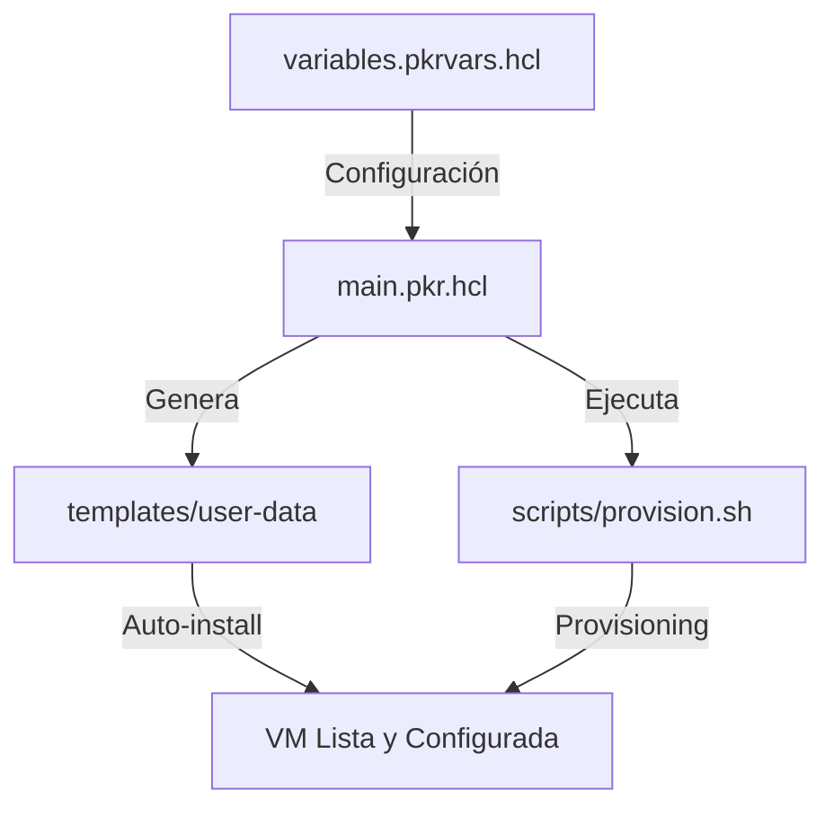

# Packer Development VM 🚀

[](https://www.packer.io/)
[](https://ubuntu.com/)
[](https://learn.microsoft.com/en-us/windows-server/virtualization/hyper-v/hyper-v-on-windows)

Una solución de infraestructura como código (IaC) para crear entornos de desarrollo portables, consistentes y totalmente configurados en Hyper-V. Centraliza toda la configuración en un único archivo y obtén una VM lista para producir en minutos.

---

## 📖 Índice

- [Filosofía](#-filosofía)
- [Características Principales](#-características-principales)
- [Requisitos](#-requisitos)
- [Quick Start](#-quick-start)
- [Estructura del Proyecto](#-estructura-del-proyecto)
- [Configuración (Variables)](#-configuración-variables)
- [Sabores (Flavors)](#-sabores-flavors)
- [Personalización de la Shell](#-personalización-de-la-shell)
- [Troubleshooting](#-troubleshooting)

---

## 🎯 Filosofía

El proyecto se basa en el principio de **Single Source of Truth** (Única Fuente de Verdad). Toda la personalización reside en `variables.pkrvars.hcl`, eliminando valores "hardcodeados" y facilitando la reproducibilidad.



---

## ✨ Características Principales

- 🐳 **Docker ready**: Engine, Compose, BuildKit, Lazydocker y Portainer (opcional).
- 🐚 **Shell Premium**: Soporte para Zsh/Bash con Oh My Zsh, Oh My Bash o Starship.
- 👨‍💻 **IDE-ready**: Instalación automatizada de VS Code, Antigravity IDE, Cursor o Sublime Merge.
- 🎨 **Estética Cuidada**: Soporte para Nerd Fonts (JetBrains Mono) y temas Dark/Light.
- 🔌 **Conectividad**: Generación automática de archivo `.rdp` para acceso instantáneo desde Windows.
- 🛠️ **Swiss Army Knife**: Git, GitHub CLI, fzf, ripgrep, bat, htop, y clientes de BD incluidos por defecto.

## 💻 Requisitos

- **SO**: Windows 10/11 Pro/Enterprise o Windows Server.
- **Hyper-V**: Habilitado y funcionando.
- **Packer**: Versión `>= 1.9.0`.
- **Permisos**: Ejecución de PowerShell como Administrador.

---

## 🚀 Quick Start

### 1. Preparación del Entorno
```powershell
# Clonar el repositorio
git clone <repo-url>
cd packer-dev-vm

# Crear tu archivo de configuración
copy variables.pkrvars.hcl.sample variables.pkrvars.hcl
```

### 2. Configuración
Edita `variables.pkrvars.hcl` para ajustar la RAM, CPUs, usuario, git credentials y herramientas a instalar.

### 3. Construcción
> [!IMPORTANT]
> **Desactiva NumLock** antes de iniciar el build. El `boot_command` de Packer puede fallar si está activo.

```powershell
# Inicializar plugins de Packer
packer init main.pkr.hcl

# Validar y Construir
packer build -var-file=variables.pkrvars.hcl main.pkr.hcl
```

### 4. Acceso
- **Credenciales por defecto**: Usuario configurable (default: `developer`), Contraseña: `developer`.
- **Acceso Rápido**: Busca en el directorio de salida (default `./output`) el archivo `.rdp` y haz doble clic.
- **Post-install**: Se recomienda cambiar la contraseña inmediatamente con `passwd`.

---

## 📂 Estructura del Proyecto

- `main.pkr.hcl`: El corazón del proyecto. Define el build de Packer.
- `variables.pkrvars.hcl`: Tu configuración personal (no se sube al repo si usas `.gitignore`).
- `templates/`: Plantillas para `cloud-init`, archivos de metadata y bienvenida HTML.
- `scripts/`: Scripts de provisioning organizados por módulos (Docker, Git, Editores, etc).
- `output/`: (Generado) Contiene el disco virtual exportado, logs y el acceso RDP.

---

## ⚙️ Configuración (Variables)

| Categoría | Variable | Descripción | Default |
|-----------|----------|-------------|---------|
| **Identidad** | `username` | Usuario del sistema | `developer` |
| | `hostname` | Nombre de la máquina | `dev-workstation` |
| **Recursos** | `memory` | RAM en MB | `8192` |
| | `cpus` | Cores asignados | `4` |
| | `disk_size` | Tamaño disco (MB) | `80000` |
| **Software** | `install_vscode` | ¿Instalar VS Code? | `true` |
| | `install_cursor` | ¿Instalar Cursor IDE?| `false` |
| | `install_antigravity`| ¿Instalar Antigravity IDE?| `false` |
| | `install_sublimemerge`| ¿Instalar Sublime Merge?| `false` |
| | `install_portainer`| ¿Instalar Portainer?| `false` |
| | `install_browser` | `firefox`, `chrome`, `none`| `firefox` |
| **Avanzado**| `network_mode` | `dhcp` o `static` | `dhcp` |
| | `static_ip` | IP estática (formato CIDR) | `172.20.144.100/20` |
| **Personalización**| `shell` | `bash` o `zsh` | `zsh` |
| | `prompt_theme` | `ohmyzsh`, `starship`, `none`| `ohmyzsh` |
| | `nerd_font` | Fuente para terminal | `JetBrainsMono` |

> [!TIP]
> Puedes ver la lista completa de variables y sus validaciones directamente en el archivo `main.pkr.hcl`.

---

## 🐧 Sabores (Flavors)

El proyecto soporta dos variantes principales de Ubuntu:

1. **Xubuntu (`vm_flavor = "xubuntu"`)**: *Recomendado*. Usa XFCE para minimizar el consumo de recursos de la VM. Ideal para desarrollo intenso.
2. **Ubuntu (`vm_flavor = "ubuntu"`)**: Usa GNOME estándar. Proporciona la experiencia completa de Ubuntu Desktop.

---

## 🐚 Personalización de la Shell

El entorno está diseñado para ser visualmente potente.

- **Oh My Zsh / Oh My Bash**: Se configuran automáticamente con temas como `agnoster` o `powerlevel10k` si seleccionas una Nerd Font.
- **Starship**: Un prompt ultra-rápido escrito en Rust, compatible con ambas shells.
- **Plugins**: Incluye `git`, `docker`, `fzf` y `syntax-highlighting` preconfigurados.

---

## 🔍 Troubleshooting

### El instalador escribe números en lugar de comandos
Esto ocurre porque **NumLock** está activado en tu teclado físico. Hyper-V interpreta las teclas de navegación como números. Apágalo antes de correr `packer build`.

### Docker no arranca / Problemas de red
Hyper-V requiere habilitar el MAC Spoofing para que los contenedores tengan visibilidad externa en ciertos escenarios.
```powershell
Get-VMNetworkAdapter -VMName "tu-vm-name" | Set-VMNetworkAdapter -MacAddressSpoofing On
```

### SSH Timeout
Si Packer no logra conectar por SSH tras la instalación:
1. Verifica que el "Default Switch" de Hyper-V esté funcionando.
2. Asegúrate de no tener un Firewall bloqueando el puerto configurado (default 22).

---
Creado con ❤️ para desarrolladores que valoran su tiempo.
